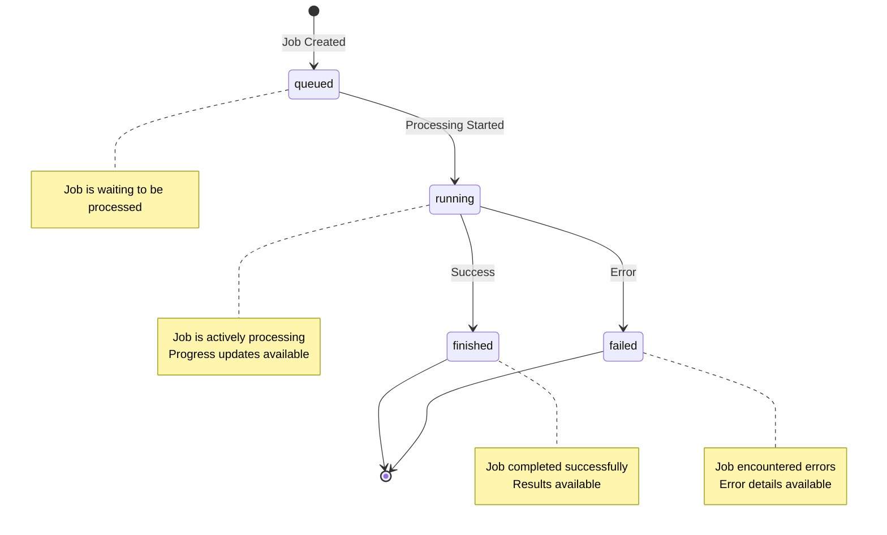

## Overview

Jobs represent asynchronous operations in the Connector Generator. Each major operation (discovery, scraping, digesting, code generation) creates a job that executes in the background, allowing your application to poll for progress and results.

All jobs follow a consistent lifecycle with standardized status values, progress tracking, and error reporting.

## Job Lifecycle



## Job States

Jobs transition through four primary states defined in the system:

```python src/common/enums.py
class JobStatus(str, Enum):
    queued = "queued"        # Job created, waiting to start
    running = "running"      # Job actively processing
    finished = "finished"    # Job completed successfully
    failed = "failed"        # Job encountered errors
    not_found = "not_found"  # Job ID doesn't exist
```

### State Descriptions

<AccordionGroup>
  <Accordion title="queued">
    **Initial State**
    
    The job has been created and queued for processing. Jobs are processed in FIFO order per job type.
    
    - No progress data available yet
    - Job hasn't started consuming resources
    - Safe to cancel at this stage
  </Accordion>

  <Accordion title="running">
    **Active Processing**
    
    The job is actively executing. This is when most processing occurs.
    
    - Progress updates are available
    - Resource consumption is active
    - `startedAt` timestamp is set
    - Job cannot be cancelled (must complete or fail)
  </Accordion>

  <Accordion title="finished">
    **Successful Completion**
    
    The job completed successfully and results are available.
    
    - Full results are accessible via `result` field
    - Session data is updated with outputs
    - `finishedAt` timestamp is set
    - Progress shows 100% completion
  </Accordion>

  <Accordion title="failed">
    **Error State**
    
    The job encountered errors and could not complete.
    
    - Detailed error messages available in `errors` array
    - Partial results may or may not be available
    - Session state may be inconsistent
    - Requires manual intervention or retry
  </Accordion>
</AccordionGroup>

## Job Schema

Jobs follow a consistent structure defined in the database models:

```python src/common/database/models/job.py
class Job(Base):
    __tablename__ = "jobs"
    
    job_id: UUID                    # Unique identifier
    session_id: UUID                # Associated session
    job_type: str                   # e.g., "discovery.getCandidateLinks"
    status: str                     # Current state (queued/running/finished/failed)
    
    created_at: datetime            # Job creation time
    updated_at: datetime            # Last update time
    started_at: datetime | None     # When processing began
    finished_at: datetime | None    # When processing completed
    
    input: Dict[str, Any]           # Job input parameters
    result: Dict[str, Any] | None   # Output data (when finished)
    errors: List[str] | None        # Error messages (when failed)
```

## Progress Tracking

Jobs provide detailed progress information through the `JobProgress` model:

```python src/common/database/models/job_progress.py
class JobProgress(Base):
    __tablename__ = "job_progress"
    
    job_id: UUID                        # Associated job
    stage: str | None                   # Current processing stage
    message: str | None                 # Human-readable status message
    total_processing: int | None        # Total items to process
    processing_completed: int | None    # Items processed so far
    updated_at: datetime                # Last progress update
```

### Processing Stages

Different job types use different stage names:

<Tabs>
  <Tab title="Documentation Processing">
    ```python src/common/enums.py
    class JobStage(str, Enum):
        queue = "queue"
        running = "running"
        chunking = "chunking"              # Splitting documentation
        processing_chunks = "processing_chunks"  # LLM analysis
        processing = "processing"          # General processing
        finished = "finished"
    ```
  </Tab>

  <Tab title="Schema Extraction (Digester)">
    ```python src/common/enums.py
    class JobStage(str, Enum):
        sorting = "sorting"                          # Identifying object classes
        sorting_finished = "sorting_finished"
        relevancy_filtering = "relevancy_filtering"  # Filtering relevant docs
        relevancy_filtering_finished = "relevancy_filtering_finished"
        resolving_duplicates = "resolving_duplicates"  # Deduplication
        aggregation_finished = "aggregation_finished"
        schema_ready = "schema_ready"                # Schema assembled
        relations_ready = "relations_ready"          # Relationships mapped
        finished = "finished"
    ```
  </Tab>

  <Tab title="Discovery & Scraping">
    ```python src/common/enums.py
    class JobStage(str, Enum):
        queue = "queue"
        running = "running"
        processing = "processing"  # Searching or scraping
        generating = "generating"  # Generating results
        finished = "finished"
    ```
  </Tab>

  <Tab title="Code Generation">
    ```python src/common/enums.py
    class JobStage(str, Enum):
        queue = "queue"
        running = "running"
        generating = "generating"  # Generating connector code
        finished = "finished"
    ```
  </Tab>
</Tabs>

## Monitoring Job Status

### Basic Status Query

Check the current status of any job:

<CodeGroup>
```bash Discovery Job
curl -X GET "http://localhost:8000/discovery/{session_id}/discovery?jobId={job_id}"
```

```bash Digester Job
curl -X GET "http://localhost:8000/digester/{session_id}/digester?jobId={job_id}"
```

```bash Scraper Job
curl -X GET "http://localhost:8000/scrape/{session_id}/scrape?jobId={job_id}"
```

```bash Codegen Job
curl -X GET "http://localhost:8000/codegen/{session_id}/codegen?jobId={job_id}"
```
</CodeGroup>

<Note>
The `jobId` query parameter is optional. If omitted, the system retrieves the job ID from the session data based on the most recent job of that type.
</Note>

### Status Response Format

The response format varies slightly by job type but follows these base schemas:

<Tabs>
  <Tab title="Stage-Based Progress">
    Used by discovery and most single-operation jobs:

    ```json
    {
      "jobId": "8f2c5d90-3a17-4b3e-9c4e-7fa8b1d6e8a2",
      "status": "running",
      "createdAt": "2026-03-10T12:00:00Z",
      "startedAt": "2026-03-10T12:00:05Z",
      "updatedAt": "2026-03-10T12:01:30Z",
      "progress": {
        "stage": "processing",
        "message": "Analyzing documentation chunks"
      }
    }
    ```

    **Schema:** `JobStatusStageResponse` (src/common/schema.py:86)
  </Tab>

  <Tab title="Document-Based Progress">
    Used by digester and multi-document processing jobs:

    ```json
    {
      "jobId": "8f2c5d90-3a17-4b3e-9c4e-7fa8b1d6e8a2",
      "status": "running",
      "createdAt": "2026-03-10T12:00:00Z",
      "startedAt": "2026-03-10T12:00:05Z",
      "updatedAt": "2026-03-10T12:01:30Z",
      "progress": {
        "stage": "processing",
        "message": "Processing documentation chunks",
        "processedDocuments": 15,
        "totalDocuments": 50
      }
    }
    ```

    **Schema:** `JobStatusMultiDocResponse` (src/common/schema.py:95)
  </Tab>

  <Tab title="Iteration-Based Progress">
    Used by scraper for iterative crawling:

    ```json
    {
      "jobId": "7c9e6679-7425-40de-944b-e07fc1f90ae7",
      "status": "running",
      "createdAt": "2026-03-10T12:00:00Z",
      "startedAt": "2026-03-10T12:00:05Z",
      "updatedAt": "2026-03-10T12:05:20Z",
      "progress": {
        "stage": "processing",
        "message": "Crawling documentation pages",
        "completedIterations": 5,
        "totalIterations": 10
      }
    }
    ```

    **Schema:** `JobStatusIterationResponse` (src/common/schema.py:89)
  </Tab>
</Tabs>

### Finished Job Response

When a job completes successfully, the response includes the full results:

<CodeGroup>
```json Discovery Results
{
  "jobId": "8f2c5d90-3a17-4b3e-9c4e-7fa8b1d6e8a2",
  "status": "finished",
  "createdAt": "2026-03-10T12:00:00Z",
  "startedAt": "2026-03-10T12:00:05Z",
  "updatedAt": "2026-03-10T12:02:45Z",
  "progress": {
    "stage": "finished",
    "message": "completed"
  },
  "result": {
    "candidateLinks": [
      "https://api.example.com/docs",
      "https://docs.example.com/api/reference"
    ],
    "searchQuery": "Example API documentation",
    "totalFound": 2
  }
}
```

```json Digester Results
{
  "jobId": "a3f7d8e9-4c2b-4f5a-b8d6-9e3c2f1a7b5d",
  "status": "finished",
  "createdAt": "2026-03-10T12:05:00Z",
  "startedAt": "2026-03-10T12:05:05Z",
  "updatedAt": "2026-03-10T12:15:30Z",
  "progress": {
    "stage": "finished",
    "message": "completed"
  },
  "result": {
    "objectClasses": [
      {
        "name": "Account",
        "displayName": "Account",
        "description": "Business account object",
        "attributes": [...],
        "operations": ["create", "read", "update", "delete"]
      }
    ],
    "totalObjectClasses": 1
  }
}
```
</CodeGroup>

### Failed Job Response

Failed jobs provide detailed error information:

```json
{
  "jobId": "8f2c5d90-3a17-4b3e-9c4e-7fa8b1d6e8a2",
  "status": "failed",
  "createdAt": "2026-03-10T12:00:00Z",
  "startedAt": "2026-03-10T12:00:05Z",
  "updatedAt": "2026-03-10T12:01:30Z",
  "errors": [
    "Failed to extract schema from documentation",
    "Insufficient documentation coverage for object 'Account'",
    "Consider uploading more comprehensive API documentation"
  ]
}
```

<Info>
The `errors` field is an array of strings, with each element representing a distinct error message or line. This format supports multi-line error details while maintaining backward compatibility.
</Info>

## Polling Best Practices

### Recommended Polling Pattern

```javascript
async function waitForJob(sessionId, jobId, jobType) {
  const maxAttempts = 120;  // 10 minutes at 5s intervals
  let attempts = 0;
  
  while (attempts < maxAttempts) {
    const response = await fetch(
      `http://localhost:8000/${jobType}/${sessionId}/${jobType}?jobId=${jobId}`
    );
    const status = await response.json();
    
    console.log(`Job ${jobId}: ${status.status}`);
    
    if (status.progress) {
      const { stage, message, processedDocuments, totalDocuments } = status.progress;
      console.log(`  Stage: ${stage}`);
      console.log(`  Message: ${message}`);
      if (totalDocuments) {
        console.log(`  Progress: ${processedDocuments}/${totalDocuments}`);
      }
    }
    
    // Check terminal states
    if (status.status === 'finished') {
      return { success: true, result: status.result };
    }
    
    if (status.status === 'failed') {
      return { success: false, errors: status.errors };
    }
    
    // Continue polling
    await new Promise(resolve => setTimeout(resolve, 5000));
    attempts++;
  }
  
  throw new Error('Job polling timeout after 10 minutes');
}
```

### Polling Recommendations

<CardGroup cols={2}>
  <Card title="Interval" icon="clock">
    Poll every 5-10 seconds during processing. More frequent polling provides minimal benefit and increases server load.
  </Card>
  
  <Card title="Timeout" icon="stopwatch">
    Set appropriate timeouts based on job type:
    - Documentation upload: 5-10 minutes
    - Discovery: 2-5 minutes
    - Scraping: 10-30 minutes
    - Digester: 10-20 minutes
    - Codegen: 5-15 minutes
  </Card>
  
  <Card title="Progress Display" icon="chart-line">
    Show progress percentages when available:
    ```
    Progress: 15/50 documents (30%)
    ```
  </Card>
  
  <Card title="Error Handling" icon="triangle-exclamation">
    Handle network errors separately from job failures. Retry on network errors, but don't retry failed jobs automatically.
  </Card>
</CardGroup>

## List All Jobs in Session

Retrieve all jobs associated with a session to see the complete history:

<CodeGroup>
```bash Request
curl -X GET "http://localhost:8000/session/{session_id}/jobs"
```

```json Response
{
  "sessionId": "550e8400-e29b-41d4-a716-446655440000",
  "jobs": [
    {
      "jobId": "7c9e6679-7425-40de-944b-e07fc1f90ae7",
      "type": "documentation.processUpload",
      "status": "finished",
      "createdAt": "2026-03-10T12:00:00Z",
      "updatedAt": "2026-03-10T12:01:30Z",
      "startedAt": "2026-03-10T12:00:05Z",
      "finishedAt": "2026-03-10T12:01:30Z"
    },
    {
      "jobId": "8f2c5d90-3a17-4b3e-9c4e-7fa8b1d6e8a2",
      "type": "digester.getObjectClass",
      "status": "running",
      "createdAt": "2026-03-10T12:02:00Z",
      "updatedAt": "2026-03-10T12:05:20Z",
      "startedAt": "2026-03-10T12:02:05Z"
    }
  ]
}
```
</CodeGroup>

This endpoint is useful for:
- Viewing complete workflow history
- Debugging workflow issues
- Identifying failed jobs that need retry
- Monitoring overall progress across multiple operations

## Job Types

The system defines several job types corresponding to different operations:

| Job Type | Description | Module |
|----------|-------------|--------|
| `discovery.getCandidateLinks` | Search for documentation URLs | Discovery |
| `scrape.getRelevantDocumentation` | Scrape and process web documentation | Scraper |
| `documentation.processUpload` | Process uploaded documentation files | Session |
| `digester.getObjectClass` | Extract schema from documentation | Digester |
| `codegen.generateConnector` | Generate connector code | CodeGen |

## Advanced Progress Tracking

### Real-time Progress Updates

For long-running jobs, implement exponential backoff or WebSocket connections for more efficient progress monitoring:

```javascript
async function pollWithBackoff(sessionId, jobId, jobType) {
  let interval = 2000;  // Start with 2s
  const maxInterval = 10000;  // Cap at 10s
  
  while (true) {
    const status = await checkJobStatus(sessionId, jobId, jobType);
    
    if (status.status === 'finished' || status.status === 'failed') {
      return status;
    }
    
    // Exponential backoff
    await new Promise(resolve => setTimeout(resolve, interval));
    interval = Math.min(interval * 1.5, maxInterval);
  }
}
```

### Progress Calculation

Calculate percentage completion when progress data is available:

```javascript
function calculateProgress(progress) {
  if (!progress) return null;
  
  const { processedDocuments, totalDocuments, completedIterations, totalIterations } = progress;
  
  if (totalDocuments > 0) {
    return Math.round((processedDocuments / totalDocuments) * 100);
  }
  
  if (totalIterations > 0) {
    return Math.round((completedIterations / totalIterations) * 100);
  }
  
  return null;
}
```

## Error Handling

### Common Error Scenarios

<AccordionGroup>
  <Accordion title="Job Not Found">
    **Status:** `not_found`
    
    The provided job ID doesn't exist or has been deleted.
    
    **Resolution:** Verify the job ID or retrieve it from session data.
  </Accordion>

  <Accordion title="Insufficient Documentation">
    **Errors:** `"Insufficient documentation coverage for object..."`
    
    The digester couldn't extract complete schema information.
    
    **Resolution:** Upload more comprehensive documentation or adjust filter instructions.
  </Accordion>

  <Accordion title="LLM Processing Failure">
    **Errors:** `"LLM processing failed for chunk..."`
    
    AI processing encountered errors on specific documentation chunks.
    
    **Resolution:** Check documentation format and content quality. Non-critical errors may allow job to complete with warnings.
  </Accordion>

  <Accordion title="Timeout/Cancellation">
    **Errors:** `"Job cancelled/interrupted..."`
    
    The job was interrupted due to system shutdown or timeout.
    
    **Resolution:** Restart the operation. Results are not saved for cancelled jobs.
  </Accordion>
</AccordionGroup>

### Retry Strategy

When a job fails, determine if retry is appropriate:

```javascript
async function retryJob(sessionId, jobInput, jobType, maxRetries = 3) {
  for (let attempt = 1; attempt <= maxRetries; attempt++) {
    console.log(`Attempt ${attempt}/${maxRetries}`);
    
    const jobResponse = await startJob(sessionId, jobInput, jobType);
    const result = await waitForJob(sessionId, jobResponse.jobId, jobType);
    
    if (result.success) {
      return result;
    }
    
    // Check if retry makes sense
    const errors = result.errors || [];
    const isRetriable = !errors.some(err => 
      err.includes('Insufficient documentation') ||
      err.includes('Invalid input')
    );
    
    if (!isRetriable) {
      console.log('Non-retriable error, aborting');
      throw new Error(`Job failed: ${errors.join(', ')}`);
    }
    
    // Exponential backoff before retry
    if (attempt < maxRetries) {
      const delay = Math.pow(2, attempt) * 1000;
      console.log(`Waiting ${delay}ms before retry...`);
      await new Promise(resolve => setTimeout(resolve, delay));
    }
  }
  
  throw new Error('Max retries exceeded');
}
```

## Related Concepts

<CardGroup cols={2}>
  <Card title="Sessions" icon="database" href="/concepts/sessions">
    Learn about session management and data persistence
  </Card>
  <Card title="Workflow" icon="diagram-project" href="/concepts/workflow">
    Understand the complete connector generation workflow
  </Card>
</CardGroup>
