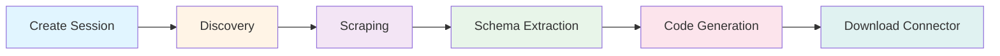
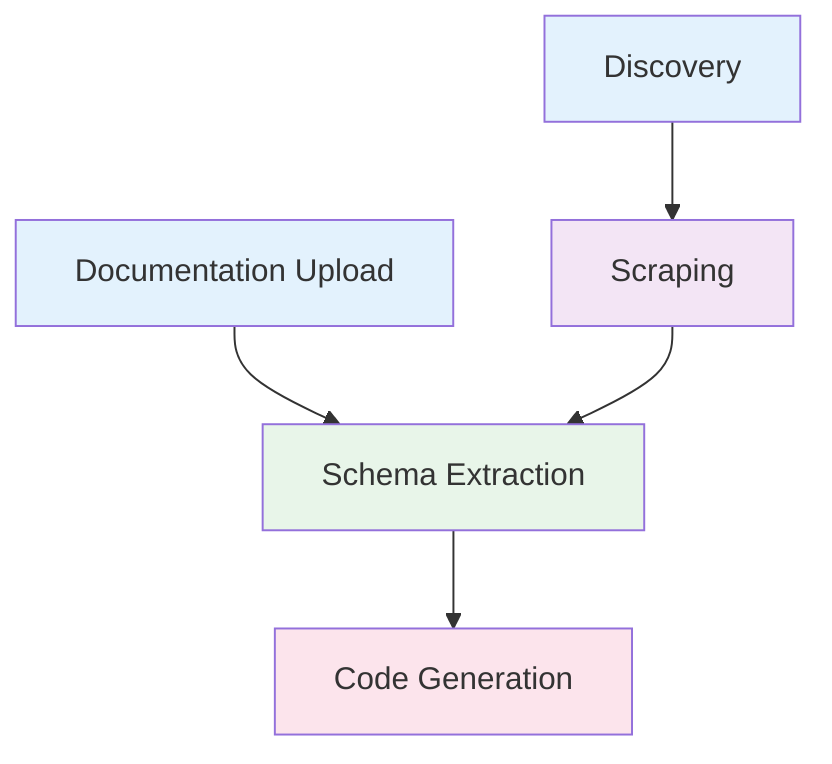

## Overview

The Connector Generator follows a multi-stage pipeline to transform API documentation into working connector code. Each stage builds upon the results of the previous stages, with all state tracked in a session.



## Stage 1: Session Creation

Every workflow begins by creating a session to track all processing state.

<CodeGroup>
```bash Create Session
curl -X POST "http://localhost:8000/session" \
  -H "Content-Type: application/json"
```

```json Response
{
  "sessionId": "550e8400-e29b-41d4-a716-446655440000",
  "message": "Session created successfully"
}
```
</CodeGroup>

<Note>
Store the `sessionId` - you'll use it in all subsequent API calls throughout the workflow.
</Note>

## Stage 2: Documentation Acquisition

You have two options for providing API documentation to the system:

<Tabs>
  <Tab title="Option A: Upload Documentation">
    Upload OpenAPI/Swagger files directly:

    ```bash
    curl -X POST "http://localhost:8000/session/{session_id}/documentation" \
      -F "documentation=@openapi.yaml"
    ```

    **When to use:**
    - You have existing OpenAPI/Swagger specifications
    - Documentation is available as downloadable files
    - You want the fastest processing time

    **Result:** Returns a job ID for monitoring the chunking and processing progress.
  </Tab>

  <Tab title="Option B: Discovery + Scraping">
    Let the system discover and scrape documentation from the web:

    ### Step 2a: Discovery

    ```bash
    curl -X POST "http://localhost:8000/discovery/{session_id}/discovery" \
      -H "Content-Type: application/json" \
      -d '{
        "applicationName": "Salesforce",
        "applicationVersion": "v1",
        "customSearchQuery": "Salesforce API documentation"
      }'
    ```

    **What it does:** Searches for and identifies candidate documentation URLs.

    ### Step 2b: Scraping

    ```bash
    curl -X POST "http://localhost:8000/scrape/{session_id}/scrape" \
      -H "Content-Type: application/json" \
      -d '{
        "applicationName": "Salesforce",
        "applicationVersion": "v1",
        "candidateLinks": ["https://developer.salesforce.com/docs/..."],
        "maxIterations": 10,
        "maxDocuments": 50
      }'
    ```

    **What it does:** Crawls the identified URLs, extracts relevant content, and processes it into documentation chunks.

    **When to use:**
    - Documentation is web-based without downloadable specs
    - You want comprehensive coverage across multiple pages
    - Source documentation is scattered across multiple URLs
  </Tab>
</Tabs>

## Stage 3: Schema Extraction (Digester)

Once documentation is loaded, extract structured schema information:

### Extract Object Classes

Identify and extract all object types (resources) from the documentation:

<CodeGroup>
```bash Extract Schema
curl -X POST "http://localhost:8000/digester/{session_id}/digester" \
  -H "Content-Type: application/json" \
  -d '{
    "applicationName": "Salesforce",
    "applicationVersion": "v1",
    "instructionsForSorter": "Focus on core business objects like Account, Contact, Lead",
    "instructionsForFilter": "Exclude internal or deprecated objects"
  }'
```

```json Response
{
  "jobId": "8f2c5d90-3a17-4b3e-9c4e-7fa8b1d6e8a2"
}
```
</CodeGroup>

**What gets extracted:**

<AccordionGroup>
  <Accordion title="Object Classes">
    Business entities like User, Account, Order with their properties and types
  </Accordion>

  <Accordion title="Attributes">
    Field definitions including data types, required/optional status, and constraints
  </Accordion>

  <Accordion title="Relationships">
    Connections between objects (foreign keys, references, hierarchies)
  </Accordion>

  <Accordion title="Operations">
    Available CRUD operations and custom endpoints for each object
  </Accordion>
</AccordionGroup>

### Monitor Extraction Progress

The digester processes documentation through multiple sub-stages:

```bash
curl -X GET "http://localhost:8000/digester/{session_id}/digester?jobId={job_id}"
```

<CodeGroup>
```json Processing
{
  "jobId": "8f2c5d90-3a17-4b3e-9c4e-7fa8b1d6e8a2",
  "status": "running",
  "progress": {
    "stage": "sorting",
    "message": "Identifying object classes in documentation"
  }
}
```

```json Completed
{
  "jobId": "8f2c5d90-3a17-4b3e-9c4e-7fa8b1d6e8a2",
  "status": "finished",
  "result": {
    "objectClasses": [
      {
        "name": "Account",
        "displayName": "Account",
        "attributes": [...],
        "operations": ["create", "read", "update", "delete"]
      }
    ]
  }
}
```
</CodeGroup>

### Retrieve Extracted Schema

Access the extracted schema from session data:

<CodeGroup>
```bash Get Object Classes
curl -X GET "http://localhost:8000/session/{session_id}"
```

```json Response
{
  "sessionId": "550e8400-e29b-41d4-a716-446655440000",
  "data": {
    "objectClasses": [
      {
        "name": "Account",
        "displayName": "Account",
        "description": "Represents a business account",
        "attributes": [
          {
            "name": "id",
            "type": "string",
            "required": true,
            "description": "Unique identifier"
          },
          {
            "name": "name",
            "type": "string",
            "required": true,
            "description": "Account name"
          }
        ],
        "operations": ["create", "read", "update", "delete"],
        "relevantChunks": [
          {
            "docUuid": "f47ac10b-58cc-4372-a567-0e02b2c3d479",
            "summary": "Account API endpoints"
          }
        ]
      }
    ]
  }
}
```
</CodeGroup>

## Stage 4: Code Generation

Generate connector code from the extracted schema:

<CodeGroup>
```bash Generate Connector
curl -X POST "http://localhost:8000/codegen/{session_id}/codegen" \
  -H "Content-Type: application/json" \
  -d '{
    "applicationName": "Salesforce",
    "applicationVersion": "v1",
    "objectClassNames": ["Account", "Contact", "Lead"],
    "connectorName": "salesforce-connector"
  }'
```

```json Response
{
  "jobId": "a3f7d8e9-4c2b-4f5a-b8d6-9e3c2f1a7b5d"
}
```
</CodeGroup>

### Code Generation Options

<ParamField path="objectClassNames" type="array">
  List of object class names to include. If not specified, generates code for all extracted objects.
</ParamField>

<ParamField path="connectorName" type="string">
  Custom name for the generated connector. Defaults to applicationName.
</ParamField>

<ParamField path="includeTests" type="boolean" default="true">
  Whether to generate test files alongside the connector code.
</ParamField>

### Monitor Generation Progress

<CodeGroup>
```bash Check Status
curl -X GET "http://localhost:8000/codegen/{session_id}/codegen?jobId={job_id}"
```

```json Running
{
  "jobId": "a3f7d8e9-4c2b-4f5a-b8d6-9e3c2f1a7b5d",
  "status": "running",
  "progress": {
    "stage": "generating",
    "message": "Generating connector code for Account"
  }
}
```

```json Completed
{
  "jobId": "a3f7d8e9-4c2b-4f5a-b8d6-9e3c2f1a7b5d",
  "status": "finished",
  "result": {
    "generatedFiles": [
      {
        "path": "src/main/java/com/evolveum/connector/Account.java",
        "content": "package com.evolveum.connector;..."
      }
    ],
    "connectorName": "salesforce-connector",
    "objectClassesGenerated": ["Account", "Contact", "Lead"]
  }
}
```
</CodeGroup>

## Stage 5: Retrieve Generated Code

Download the complete connector code:

<CodeGroup>
```bash Get Generated Code
curl -X GET "http://localhost:8000/session/{session_id}"
```

```json Response
{
  "sessionId": "550e8400-e29b-41d4-a716-446655440000",
  "data": {
    "generatedCode": {
      "files": [
        {
          "path": "src/main/java/com/evolveum/connector/SalesforceConnector.java",
          "content": "..."
        },
        {
          "path": "pom.xml",
          "content": "..."
        }
      ],
      "metadata": {
        "connectorName": "salesforce-connector",
        "generatedAt": "2026-03-10T12:45:00Z"
      }
    }
  }
}
```
</CodeGroup>

## Complete Workflow Example

Here's a complete example workflow using cURL:

<CodeGroup>
```bash Full Workflow Script
#!/bin/bash

# Step 1: Create session
SESSION_RESPONSE=$(curl -s -X POST "http://localhost:8000/session")
SESSION_ID=$(echo $SESSION_RESPONSE | jq -r '.sessionId')
echo "Created session: $SESSION_ID"

# Step 2: Upload documentation
DOC_RESPONSE=$(curl -s -X POST \
  "http://localhost:8000/session/$SESSION_ID/documentation" \
  -F "documentation=@openapi.yaml")
DOC_JOB_ID=$(echo $DOC_RESPONSE | jq -r '.jobId')
echo "Documentation processing job: $DOC_JOB_ID"

# Wait for documentation processing
while true; do
  STATUS=$(curl -s "http://localhost:8000/session/$SESSION_ID/jobs" | \
    jq -r ".jobs[] | select(.jobId==\"$DOC_JOB_ID\") | .status")
  echo "Documentation status: $STATUS"
  [[ "$STATUS" == "finished" ]] && break
  sleep 5
done

# Step 3: Extract schema
DIGEST_RESPONSE=$(curl -s -X POST \
  "http://localhost:8000/digester/$SESSION_ID/digester" \
  -H "Content-Type: application/json" \
  -d '{
    "applicationName": "MyAPI",
    "applicationVersion": "v1"
  }')
DIGEST_JOB_ID=$(echo $DIGEST_RESPONSE | jq -r '.jobId')
echo "Schema extraction job: $DIGEST_JOB_ID"

# Wait for schema extraction
while true; do
  STATUS=$(curl -s "http://localhost:8000/digester/$SESSION_ID/digester?jobId=$DIGEST_JOB_ID" | \
    jq -r '.status')
  echo "Schema extraction status: $STATUS"
  [[ "$STATUS" == "finished" ]] && break
  sleep 5
done

# Step 4: Generate code
CODEGEN_RESPONSE=$(curl -s -X POST \
  "http://localhost:8000/codegen/$SESSION_ID/codegen" \
  -H "Content-Type: application/json" \
  -d '{
    "applicationName": "MyAPI",
    "applicationVersion": "v1",
    "connectorName": "myapi-connector"
  }')
CODEGEN_JOB_ID=$(echo $CODEGEN_RESPONSE | jq -r '.jobId')
echo "Code generation job: $CODEGEN_JOB_ID"

# Wait for code generation
while true; do
  STATUS=$(curl -s "http://localhost:8000/codegen/$SESSION_ID/codegen?jobId=$CODEGEN_JOB_ID" | \
    jq -r '.status')
  echo "Code generation status: $STATUS"
  [[ "$STATUS" == "finished" ]] && break
  sleep 5
done

# Step 5: Retrieve generated code
curl -s "http://localhost:8000/session/$SESSION_ID" | \
  jq -r '.data.generatedCode' > generated_connector.json

echo "Connector generated successfully!"
```
</CodeGroup>

## Job Dependencies

Understanding job dependencies is crucial for workflow orchestration:



<Warning>
**Important:** Each stage requires the previous stage to complete successfully. Always check job status before proceeding to the next stage.
</Warning>

## Workflow Optimization

### Result Caching

The system automatically caches job results to avoid redundant processing:

```json
{
  "usePreviousSessionData": true
}
```

When enabled:
- **Documentation processing**: Reuses processed chunks from previous uploads of the same content
- **Schema extraction**: Reuses identified object classes if documentation hasn't changed
- **Code generation**: Reuses generated code structures for unchanged schemas

<Tip>
Result caching can reduce processing time by 70-90% for repeated operations with similar inputs. The system checks for compatible previous jobs within a configurable time window (default: 24 hours for digester, 7 days for discovery).
</Tip>

### Parallel Processing

Some stages support parallel execution:

- Multiple documentation files can be uploaded simultaneously
- Schema extraction for different object classes runs in parallel
- Code generation for multiple object classes is parallelized

### Error Recovery

If a job fails:

1. **Check error details** from the job status endpoint
2. **Review session state** to identify which stage failed
3. **Fix the issue** (e.g., provide better instructions, adjust parameters)
4. **Retry from the failed stage** - no need to restart the entire workflow

<CodeGroup>
```bash Check Failed Job
curl -X GET "http://localhost:8000/digester/{session_id}/digester?jobId={job_id}"
```

```json Failed Job Response
{
  "jobId": "8f2c5d90-3a17-4b3e-9c4e-7fa8b1d6e8a2",
  "status": "failed",
  "errors": [
    "Failed to extract schema: Insufficient documentation coverage for object 'Account'",
    "Consider adding more documentation or adjusting filter instructions"
  ]
}
```
</CodeGroup>

## Best Practices

<AccordionGroup>
  <Accordion title="Monitor Job Progress">
    Poll job status endpoints every 5-10 seconds during processing. Jobs may take several minutes depending on documentation size and complexity.
  </Accordion>

  <Accordion title="Provide Clear Instructions">
    When using the digester, provide clear `instructionsForSorter` and `instructionsForFilter` to guide the extraction process. Specific instructions yield better results.
  </Accordion>

  <Accordion title="Validate Intermediate Results">
    Check the extracted schema before proceeding to code generation. Review `objectClasses` in the session data to ensure all expected objects were found.
  </Accordion>

  <Accordion title="Use Appropriate maxIterations">
    For scraping, start with conservative `maxIterations` (10-20). Increase only if coverage is insufficient. Higher values increase processing time and costs.
  </Accordion>

  <Accordion title="Clean Up Sessions">
    Delete sessions after downloading generated code to free storage. Sessions can accumulate significant data.
  </Accordion>
</AccordionGroup>

## Related Concepts

<CardGroup cols={2}>
  <Card title="Sessions" icon="database" href="/concepts/sessions">
    Understand session management and data structure
  </Card>
  <Card title="Job Status" icon="list-check" href="/concepts/job-status">
    Learn about job lifecycle and progress tracking
  </Card>
</CardGroup>
